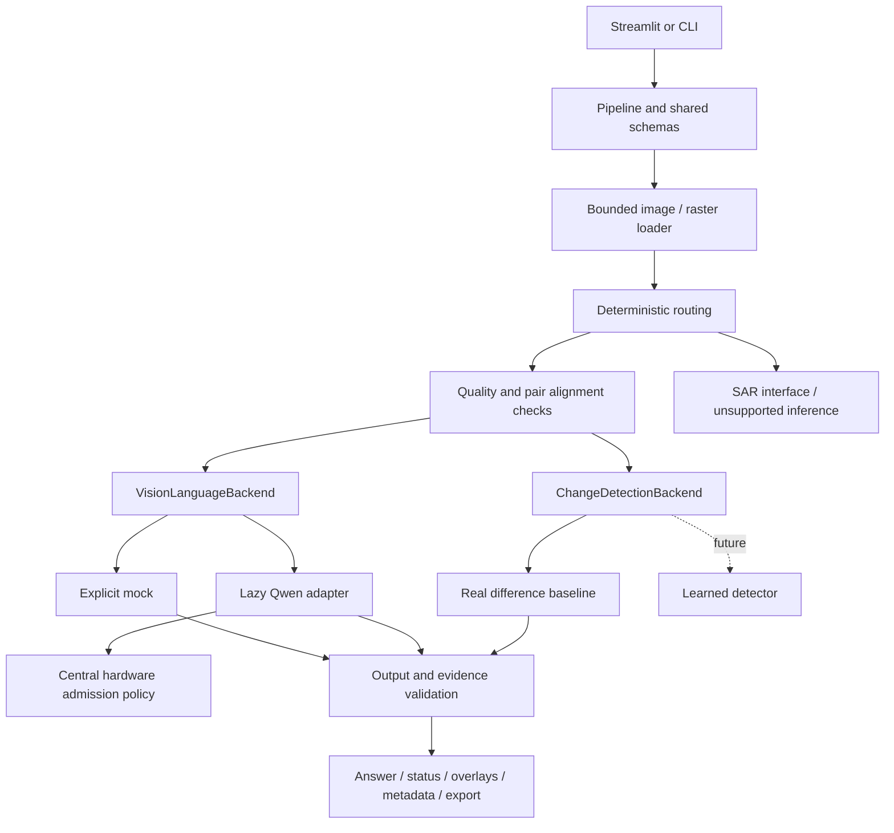

# SatQuery AI

An evidence-first remote-sensing assistant MVP for **Smart India Hackathon 2026, SIH26167 / ISRO**, team **HACK O NOVA**. Upload a tile or an aligned before/after pair, ask a question, inspect spatial evidence, and export the result with source metadata and limitations.

The complete supplied proposal was reviewed before implementation. [Proposal traceability](docs/requirements.md) maps its six slides to requirements. [Engineering review](docs/engineering-review.md) records the hardware, verification and remaining gaps.

## Implementation status

| State | Capability |
| --- | --- |
| **WORKING** | Streamlit and CLI; PNG/JPEG/TIFF loading; bounded raster previews/windows/tiles; metadata/nodata preservation; routing; quality/alignment screening; validated boxes; masks/overlays; coordinate conversion; ZIP/JSON/GeoJSON/GeoTIFF evidence export |
| **WORKING** | Real CPU absolute-difference baseline with shared radiometric scaling, morphology, components, masks and pixel statistics |
| **WORKING / DEVELOPMENT** | Explicit mock optical backend, synthetic sample pack, evaluation framework and tests without model weights |
| **EXPERIMENTAL** | Lazy Qwen2.5-VL-3B integration, hardware admission and structured grounding. Contract-tested with fake inference; **real model inference was not run** on this 4 GiB laptop |
| **EXPERIMENTAL** | Linux CUDA 4-bit configuration and PEFT adapter factory; neither exercised with actual weights |
| **PLANNED / UNSUPPORTED** | Learned change network, semantic water/vegetation/built-up transitions, SAR calibration/understanding, optical/SAR fusion, full training and calibrated semantic reliability |

Mock answers never identify real satellite features. The baseline measures **appearance differences**, not flood extent, damage or a learned probability. Qwen candidate answers require review: coordinate validity does not verify meaning. There are no claimed real-scene benchmarks.

## Windows PowerShell setup

Run from the repository root. `.venv` already exists on this development machine; create it only on a fresh checkout.

```powershell
cd C:\Users\91629\satquery-ai
python -m venv .venv
.\.venv\Scripts\python.exe -m pip install -e ".[dev]"
.\.venv\Scripts\python.exe -m satquery hardware
.\.venv\Scripts\python.exe -m streamlit run app.py
```

Open [the local demo](http://127.0.0.1:8501). Default: **MOCK / DEVELOPMENT MODE**, no model download. Select **Before / after** to run the real baseline on the synthetic sample pair. Stop a foreground server with Ctrl+C.

Optional activation:

```powershell
.\.venv\Scripts\Activate.ps1
python -m streamlit run app.py
```

If PowerShell blocks activation, use the direct `.venv\Scripts\python.exe` commands; no execution-policy change is needed. Git Bash activation is `source .venv/Scripts/activate`. For the exact direct-package versions validated here:

```powershell
.\.venv\Scripts\python.exe -m pip install -c constraints/local-tested.txt -e ".[dev]"
```

The constraints capture tested base/test packages, not a universal transitive lockfile or ML environment.

## Linux/macOS setup

```bash
python3 -m venv .venv
source .venv/bin/activate
python -m pip install -e '.[dev]'
python -m satquery hardware
python -m streamlit run app.py
```

The application uses pathlib and has no Windows shell dependency. Python 3.11 is validated; package metadata permits 3.11–3.13. Linux/macOS execution was not tested in this Windows session.

## Architecture



The reference's separation of application logic and specialist models is retained. Small cohesive modules replace many one-function directories. The pipeline accepts injected optical/change/SAR providers; the frontend reads a shared `Result`, never arbitrary prose. Arrays stay in `LoadedImage`/`PipelineOutput`; serializable records contain mask summaries and exported artifacts. No database, paid API, authentication system or orchestration framework is required.

```text
satquery-ai/
├── app.py, pyproject.toml, README.md
├── .env.example, .gitignore, .streamlit/config.toml
├── config/{local,cloud}.yaml
├── constraints/local-tested.txt
├── satquery/
│   ├── __init__.py, __main__.py, cli.py
│   ├── config.py, schemas.py, hardware.py
│   ├── io.py, geo.py, routing.py
│   ├── pipeline.py, evidence.py, grounding.py
│   ├── visualization.py, export.py, samples.py, evaluation.py
│   └── backends/{__init__,base,mock,qwen,change,sar}.py
├── training/{__init__,lora,change}.py
├── tests/
│   ├── conftest.py, test_config_schemas.py, test_io_geo.py
│   ├── test_grounding.py, test_pipeline_evidence.py, test_hardware_qwen.py
│   └── test_evaluation_training_ui.py, test_regressions.py
├── data/samples/
│   ├── README.md, eval.jsonl
│   ├── {flood,vegetation,urban,no_change}_{before,after}.{png,tif}
│   └── {flood,vegetation,urban,no_change}_mask.png
└── docs/{requirements,engineering-review,evaluation,training}.md
```

`.venv/`, `tmp/`, `output/`, caches and weights are ignored. The repository originally contained only Git metadata.

## Configuration

Precedence: schema defaults, selected YAML, `SATQUERY_*` environment overrides, explicit CLI/UI overrides. `SATQUERY_CONFIG` selects YAML. The UI defaults to `config/local.yaml`; the CLI uses schema defaults unless configured. Unknown keys and incompatible dtype/device combinations fail validation. `.env.example` is documentation; `.env` is not auto-loaded.

```powershell
$env:SATQUERY_CONFIG = "config/local.yaml"
$env:SATQUERY_BACKEND = "mock"
$env:SATQUERY_MAX_IMAGE_SIZE = "1024"
$env:SATQUERY_RGB_BANDS = "[3, 2, 1]"
```

RGB indices refer to bands **inside your file**, which may differ from satellite product band names. Clear product-specific overrides when changing products. Relative paths resolve from the working directory. Pin `model_revision` to a verified model commit for reproducible real-model experiments.

Local settings use 1024-pixel previews and 512-pixel tiles; cloud settings use 1536-pixel previews, larger visual-token limits and Qwen/CUDA defaults. One inference request at a time is supported. Batching, full-scene stitching, repeated-inference agreement and distributed training remain future work.

## Hardware and Qwen

Detected on 2026-09-07: Windows 11 Home build 26200, Ryzen 7 **5800H**, 15.35 GiB OS-visible RAM, and **NVIDIA GeForce RTX 3050 Laptop GPU, 4096 MiB VRAM**. Global Python: 3.11.3; global PyTorch: 2.7.1+cu118 with CUDA available. The isolated project environment intentionally has **no PyTorch**. Driver 592.82 advertises CUDA 13.1 compatibility; this is not an installed toolkit version. PyTorch's compiled CUDA runtime is 11.8.

`python -m satquery hardware` inspects the active environment. Hardware checks also run when real Qwen loading is requested. `hardware.py` owns device, dtype and admission policy. There is no implicit CPU/disk offload and no model download on install, import, backend selection or Streamlit startup.

| Execution | Resource policy / estimate |
| --- | --- |
| Local UI/mock/baseline | No GPU/VRAM requirement; allow 1–2 GiB free RAM for ordinary previews and more for large compressed image decoding. Up to 4 GiB headroom is prudent near input limits; estimates, not peak measurements |
| Qwen FP16/BF16 | At least **10 GiB free VRAM** and **6 GiB available RAM**; a 16 GiB GPU is a practical starting target, subject to actual image/token usage |
| Qwen FP32 CUDA | At least 18 GiB free VRAM and 6 GiB available RAM |
| Qwen FP32 CPU | At least 20 GiB available RAM; expected to be slow |
| Qwen 4-bit | Experimental Linux/CUDA only, optional bitsandbytes; at least 6 GiB free VRAM and 6 GiB available RAM |

Admission estimates are conservative, not guarantees for arbitrary replacement models or token limits. The 4 GiB laptop is intentionally rejected. No ML installation is needed to run the local demo.

On a suitable **Linux/cloud CUDA machine**, inspect existing torch first and reuse a compatible environment. Otherwise, an isolated setup with an official compatible wheel pair is:

```bash
python3 -m venv .venv
source .venv/bin/activate
python -m pip install torch==2.8.0 torchvision==0.23.0 --index-url https://download.pytorch.org/whl/cu126
python -m pip install -e '.[ml,dev]'
python -m satquery hardware
export SATQUERY_CONFIG=config/cloud.yaml
export SATQUERY_ALLOW_MODEL_DOWNLOAD=true
python -m streamlit run app.py
```

Only **Run analysis** on the real optical path requests weights. Budget several GB of model download/cache storage; none are bundled. After downloading, set `SATQUERY_ALLOW_MODEL_DOWNLOAD=false` for cached offline inference. Alternatively set `SATQUERY_MODEL_ID` to a complete local model directory. Missing dependencies/cache return `UNSUPPORTED`. Use an authorized notebook preview or SSH tunnel to the localhost listener; this project does not expose a public service automatically.

On a sufficiently capable Windows GPU machine, install matching official CUDA wheels and `.[ml,dev]`, then:

```powershell
$env:SATQUERY_CONFIG = "config/cloud.yaml"
$env:SATQUERY_ALLOW_MODEL_DOWNLOAD = "true"
python -m streamlit run app.py
```

The Windows 4-bit path is unavailable. The adapter uses Transformers **4.57.1**, SDPA, safetensors and `trust_remote_code=False`. Visual-pixel limits, generation length and sampling are configurable. References: [official PyTorch wheel pairs](https://pytorch.org/get-started/previous-versions/), [Transformers Qwen API](https://huggingface.co/docs/transformers/v4.57.1/en/model_doc/qwen2_5_vl), [Qwen model card](https://huggingface.co/Qwen/Qwen2.5-VL-3B-Instruct).

## Optical QA and evidence policy

Example questions: “Where is the main water body?” and “Which area appears built-up?” Mock mode returns a clearly synthetic region and no confidence score. Qwen requests JSON with normalized boxes; validation also accepts explicitly declared pixel and 0–1000 spaces. Reversed, non-finite, out-of-range, string/boolean or malformed coordinates reject the output. A response without spatial evidence is withheld. Boxes predominantly over nodata are rejected.

Evidence checks weight input quality 40%, metadata completeness 10%, structured output 20%, spatial evidence 20%, and alignment 10% for change analysis (or spatial evidence for optical). This is **not calibrated semantic confidence**. The formula and signals are exported. All real optical candidates remain `LOW_EVIDENCE` pending independent semantic verification. Lowering a threshold does not override no-grounding gates or certify an answer.

Quality checks flag extreme brightness/darkness, almost-flat imagery and invalid/nodata-dominated inputs; they are not cloud detection. Statuses: `OK`, `LOW_EVIDENCE`, `NEED_BETTER_INPUT`, `INVALID_INPUT`, `INVALID_OUTPUT`, `UNSUPPORTED`. An `OK` change result denotes an implemented baseline measurement passing checks, not a verified disaster interpretation.

## Change detection

```powershell
.\.venv\Scripts\python.exe -m satquery analyze data/samples/flood_before.tif data/samples/flood_after.tif --question "Show appearance differences" --output output/evidence.zip
```

The baseline uses original scale/offset-adjusted bands at preview resolution. Both observations share each band's 2–98 percentile range for normalized absolute difference. It averages across selected bands, thresholds, optionally opens with a 3×3 kernel, and removes small components. Outputs: numerical difference, binary mask, region boxes and shared-valid-pixel statistics. No-change results legitimately have empty masks.

The gate checks bands/dtype/scales, known sensors/dates, CRS and preview grids, then phase correlation for translations. It rejects detected shifts and uncertain matches. User attestation may accept independently verified registration when automated screening is inconclusive; the result stays `LOW_EVIDENCE`, and attestation cannot override detected shifts/grid mismatch. No auto-registration is performed. Rotation/parallax, cloud, lighting and seasonality can still confound results.

“Show where water increased between these dates” and “What major land-cover change is visible?” are routed to comparison, with an explicit qualification: this baseline cannot classify changed pixels or determine semantic increase/decrease. Learned/spectral semantic analysis remains future work.

## GeoTIFF, windows and SAR

Rasterio reads selected bands into bounded arrays, preserving CRS, original and preview affines, source dimensions, band descriptions/tags, scales, offsets and nodata. Percentile preview colors are not guaranteed true color. Sensor/date metadata is retained only when available. TIFF modification times are not acquisition times; ordinary image EXIF capture times are labeled unverified.

Coordinates refer to the loaded preview. Its affine includes window offsets and resampling, including rotation/shear. Source XY stays labeled with its CRS. WGS84 GeoJSON is reprojected in **longitude, latitude** order. Boxes use pixel edges; `pixel_to_world(..., center=True)` uses pixel centers. Raster loading follows [Rasterio window guidance](https://rasterio.readthedocs.io/en/stable/topics/windowed-rw.html) and [resampling transforms](https://rasterio.readthedocs.io/en/stable/topics/resampling.html).

```powershell
.\.venv\Scripts\python.exe -m satquery analyze data/samples/flood_before.tif data/samples/flood_after.tif --question "Compare" --window 32 64 128 128 --output output/window-evidence.zip
```

`satquery.io.iter_tiles(path, settings)` yields georeferenced tiles. Tiny edge strips use overlapping edge windows; mosaicking is not implemented. Uploads default to 64 MiB; PNG/JPEG decoding is limited to 40 million source pixels. Local TIFF paths may exceed the upload cap because they are window-read; GDAL block layouts can still affect I/O/memory.

Sentinel-1/SAR/polarization metadata triggers SAR routing; users can select sensor type when metadata is missing. SAR has a finite/nodata-aware grayscale percentile preview, without assuming amplitude, intensity or calibrated dB. Inference and optical/SAR consistency return `UNSUPPORTED`. SAFE/XML ingestion, calibration, speckle filtering and fusion remain planned.

## Export

ZIP contents include `result.json`, `overlay.png`, source previews, and where applicable `change.png`, `valid.png`, `difference.npy`, `difference.png`. Georeferenced results add `change.tif` (0=no change, 1=change, 255=nodata) and WGS84 `regions.geojson` for bounding polygons. No-change masks need no polygons. Masks retain analyzed preview/window resolution.

Provenance records settings, question, version, loaded analysis/validity hashes and model revision when available. Local TIFFs are not fully hashed to avoid large scans; analyzed-window data is hashed. The application is a single-user local tool, not a hardened public multi-tenant service.

## Tests and evaluation

```powershell
.\.venv\Scripts\python.exe -m pytest -q
.\.venv\Scripts\python.exe -m ruff check .
.\.venv\Scripts\python.exe -m ruff format --check .
.\.venv\Scripts\python.exe -m compileall -q app.py satquery training
.\.venv\Scripts\python.exe -m pip check
.\.venv\Scripts\python.exe -m satquery evaluate data/samples/eval.jsonl --config config/local.yaml --output output/synthetic-evaluation.json
```

The 119 tests cover configuration, schemas, routing, corrupt inputs, nodata, coordinates, quality, alignment, masks, rejection, backend failure, hardware guards, mocked Qwen generation, imports, exports, UTF-8 CLI output, metrics and Streamlit interactions, including stale schema objects and invalid stored evidence. They never download Qwen. Four procedural flood/vegetation/urban/no-change cases validate implementation; exact rectangle overlap is not real-world accuracy.

Regenerate samples with `python -m satquery samples`. [Evaluation instructions](docs/evaluation.md) explain expansion to roughly 20 scenes / 100 fixed questions. No real annotated pack was supplied or downloaded.

## Training and roadmap

`python -m training.lora MANIFEST.jsonl` performs preflight only; a lazy PEFT adapter factory accepts an already-loaded model. `python -m training.change` prints a future detector contract. Neither trains. [Training notes](docs/training.md) specify remaining collation, loss masking, held-out validation and checkpoint work.

Next priorities:

1. Validate cached pretrained Qwen on suitable hardware using licensed, independently annotated 20-scene/100-question data; measure grounding, correctness and abstentions.
2. Add robust registration and sensor-aware cloud/radiometric checks, then validated semantic water/vegetation change analysis.
3. Build cloud LoRA collation/training and calibration experiments on held-out scenes; subsequently implement calibrated SAR preprocessing and measured fusion.

